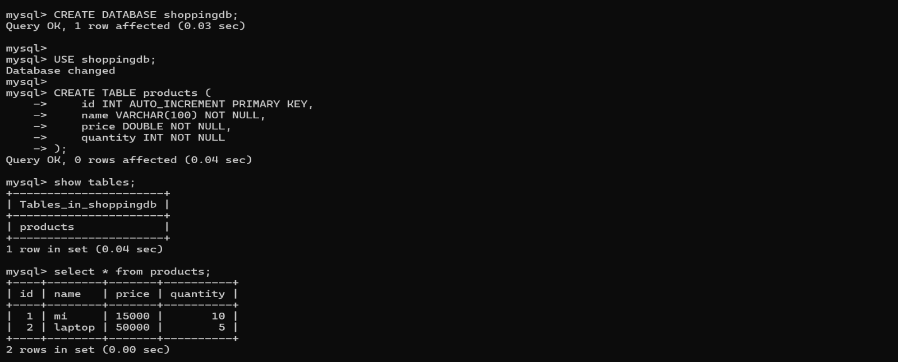

Program 5: Java Standalone Application with MySQL (CRUD Operations)

Objective

This project is a Java Standalone Application that connects to a MySQL database and performs CRUD (Create, Read, Update, Delete) operations on a product table. It's designed to demonstrate Java-Database connectivity using JDBC.

Prerequisites 

Before running this application, make sure you have the following installed:

1.	MySQL Server– Ensure MySQL is installed and running.
2.	MySQL Workbench – Optional, for GUI-based database management.
3.	Java Development Kit (JDK) – Java 8 or later.
4.	VS Code / IntelliJ / Eclipse – Any IDE that supports Java.
5.	MySQL Connector/J (JDBC Driver) – Required for Java-MySQL connectivity.
  

Installation & Setup
Step 1: Install Required Software
•	Download and install MySQL Server: [https://dev.mysql.com/downloads/mysql/](https://dev.mysql.com/downloads/mysql/)
•	Install MySQL Workbench (Optional): [https://dev.mysql.com/downloads/workbench/](https://dev.mysql.com/downloads/workbench/)
•	Install JDK: [https://www.oracle.com/java/technologies/javase-downloads.html](https://www.oracle.com/java/technologies/javase-downloads.html)
•	Install VS Code: [https://code.visualstudio.com/](https://code.visualstudio.com/)
•	Download MySQL Connector/J: [https://dev.mysql.com/downloads/connector/j/](https://dev.mysql.com/downloads/connector/j/)

Step 2: Configure MySQL Database

Use MySQL Workbench or terminal to set up the database.
CREATE DATABASE shoppingdb;

USE shoppingdb;

CREATE TABLE products (
    id INT AUTO_INCREMENT PRIMARY KEY,
    name VARCHAR(100) NOT NULL,
    price DOUBLE NOT NULL,
    quantity INT NOT NULL
    );

Step 3: Set Up Java Project
1.	Create a folder structure:
java-crud-app/
├── src/
│   └── Main.java
├── lib/
│   └── mysql-connector-j-<version>.jar
└── bin/

2.	Load JDBC Driver in Java:
Class.forName("com.mysql.cj.jdbc.Driver");

3.	Include MySQL Connector/J in the classpath when compiling and running:
javac -cp ".;lib/mysql-connector-j-9.3.0.jar" -d bin src/Main.java
java -cp ".;bin;lib/mysql-connector-j-9.3.0.jar" Main

Step 4: Implement CRUD Operations
•	Create – Insert new product
•	Read – View all products
•	Update – Modify product details
•	Delete – Remove product

Sample Java Code – Database Connection
import java.sql.*;

public class DatabaseConnection {
    public static void main(String[] args) {
        String url = "jdbc:mysql://localhost:3306/crud_db";
        String user = "root";
        String password = "your_password";

        try {
            Connection conn = DriverManager.getConnection(url, user, password);
            System.out.println("Connected to MySQL successfully!");
            conn.close();
        } catch (SQLException e) {
            e.printStackTrace();
        }
    }
}

Step 5: Running the Application
1.	Compile:
javac -cp ".;lib/mysql-connector-j-9.3.0.jar" -d bin src/Main.java

2.	Run:
java -cp ".;bin;lib/mysql-connector-j-9.3.0.jar" Main

3.	If successful, you'll see:
--- Product Management ---
1. Add Product
2. View All Products
3. Update Product
4. Delete Product
5. Exit

Contributing
Feel free to fork this repository and suggest improvements via pull requests. All contributions are welcome!

License
This project is open-source and available under the MIT License

Author
<<<<<<< HEAD
•pavankumar

=======
•tarunteja
>>>>>>> 6ebb647da10bf7d46a467a21fc35beba04beec88
