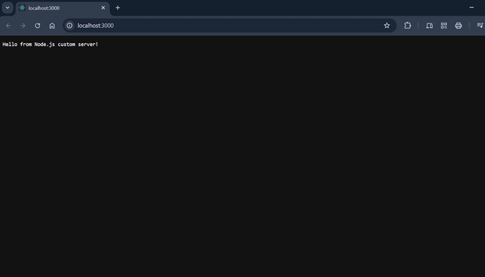

PROGRAM 8 – Custom Server and Core Modules in Node.js

AIM  
To create a custom HTTP server using Node.js and explore core built-in modules such as `os`, `path`, and `events`.

DESCRIPTION  
This experiment demonstrates how to build a simple HTTP server using Node.js without any external frameworks. It also showcases how to interact with system-level information, file paths, and custom events using Node.js core modules.The solution uses Node.js for server-side programming and the built-in `http`, `os`, `path`, and `events` modules to explore their functionalities in a backend environment. This helps in understanding how Node.js handles server creation and system-level operations using its standard library.

PROJECT STRUCTURE  
node-server-demo/
│
├── server.js # Creates a basic HTTP server
├── osInfo.js # Displays OS information using 'os' module
├── pathDemo.js # Demonstrates path operations using 'path' module
├── eventDemo.js # Emits and listens for events using 'events' module
├── README.md # Project documentation

IMAGES
pathDemo.js
 
eventDemo.js
 
osInfo.js 

Server.js
 
MODULES USED  
•	http – To create the web server.  
•	os – To fetch system-related data such as platform, memory, and CPU info.  
•	path – To handle file and directory paths.  
•	events – To handle event-driven architecture by emitting and responding to events.

INSTALLATION & SETUP  
PREREQUISITES  
•	Node.js installed on your system  
•	Visual Studio Code (VS Code) or any preferred IDE  

STEPS TO RUN THE PROJECT  
1. Open terminal and navigate to the project directory:
cd node-server-demo

2. Open the project in VS Code:
code .

3. Run each file individually to test different modules:
node server.js
To start the HTTP server:

Then open your browser and visit:
http://localhost:3000

node osInfo.js
To run OS module demo:

node pathDemo.js
To run Path module demo:

node eventDemo.js
To run Events module demo:

OUTPUT EXAMPLES  
•	server.js – Displays a web page with "Hello from Node.js custom server!"  
•	osInfo.js – Outputs platform, memory, uptime, and user info  
•	pathDemo.js – Shows file name, extension, directory, and path joining  
•	eventDemo.js – Logs "Hello, Alice!" using a custom event

LICENSE  
This project is open-source and available under the MIT License.

Contributing
Feel free to fork this repository and suggest improvements via pull requests. All contributions are welcome!

Author
•pavakumar

