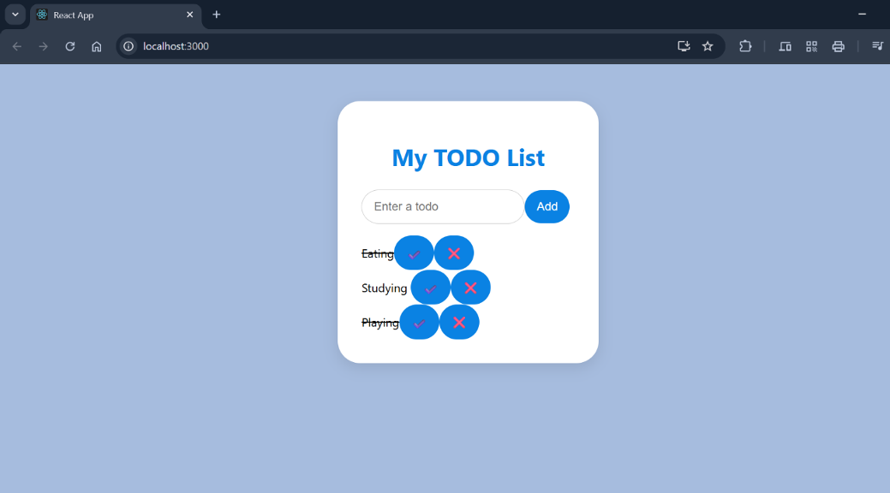

PROGRAM 13 – React TODO App

AIM  
To develop a TODO list application frontend using React, allowing users to add, complete, and delete tasks with a clean Canva-style UI.

DESCRIPTION  
This experiment demonstrates how to build a single-page TODO application using React.js. The app allows users to manage their daily tasks in a dynamic and interactive way. It showcases React concepts like state management using use State, component-based architecture, and basic form handling. This project is ideal for beginners to learn about React components, props, state management, conditional rendering, and basic CSS styling.

PROJECT STRUCTURE  
todo-app/
│
├── public/
│ └── index.html # HTML template
│
├── src/
│ ├── components/
│ │ ├── TodoForm.js # Component to add new tasks
│ │ ├── TodoItem.js # Component to render a single task
│ │ └── TodoList.js # Component to list all tasks
│ ├── App.js # Main application component
│ ├── App.css # Styling for the app (Canva style)
│ └── index.js # Entry point of the React app
│
├── package.json # Project metadata and dependencies
└── README.md # Project documentation

INSTALLATION & SETUP
PREREQUISITES  
•	Node.js & npm  
•	VS Code or any code editor  
•	Basic knowledge of React  

STEPS TO RUN THE PROJECT  
1. Create Project using Create React App  
npx create-react-app todo-app  
cd todo-app

2.Create Components
Inside src/components/, create the following files:
•	TodoForm.js
•	TodoItem.js
•	TodoList.js
Each should return respective JSX as defined in the project.
3.Add Logic in App.js
Implement useState for managing TODOs, and pass methods for adding, toggling, and removing tasks.
4.Style the App
Use App.css to add modern, Canva-style UI.
5.Run the Project
npm start

6.Visit in Browser
Open your browser and go to:
http://localhost:3000

LICENSE
This project is licensed under the MIT License.

